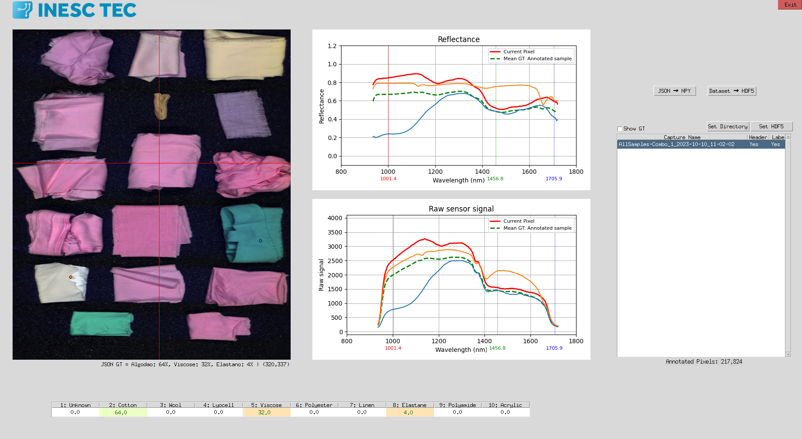

# HyperTex Dataset Viewer & Interface

This repository provides a desktop viewer (GUI) and preprocessing utilities for inspecting **HyperTex** hyperspectral textile captures (Specim FX17 sensor) and managing ground-truth annotations and HDF5 dataset creation.

HyperTex contains Specim FX17 hyperspectral captures of textile materials (pure fibres and blends). Each annotated pixel is represented by a 10-channel target array corresponding to fibre composition percentages.



---

## Included Tools & Files

- `gui.py` — Desktop GUI viewer built with Tkinter, Matplotlib, OpenCV, and Pillow. Features include:
  - False-colour RGB rendering with selectable RGB bands.
  - Interactive cursor-driven reflectance and raw-signal spectral plots.
  - Fibre composition classification inspector per pixel.
  - Ground-Truth (GT) overlay toggle (**Show GT**).
  - **JSON → NPY**: Batch converts LabelMe polygon annotations into 10-channel target NPY composition maps.
  - **Dataset → HDF5**: Packages selected sample captures and ground-truth maps into `/data` and `/gt` groups in HDF5 format for training.
- `utils.py` — ENVI header/data loader, LabelMe annotation parser, ground-truth map generator, color mapping utilities, and HDF5 export utilities.
- `bands_fx17.txt` — Wavelength calibration file for the 224 spectral bands of the Specim FX17 sensor.
- `classes.txt` / `classes_en.txt` — Predefined list of the 10 textile fibre classes.
- `images/` — GUI logos and icon assets (`inesctec-logo.png`, `iilab-logo.png`, `logo.png`).
- `data/` — Optional directory used to store downloaded HyperTex samples for visualization and processing

---

## Setup & Installation

Ensure you have a Python 3.9+ environment active.

Then install the dependencies:

```bash
pip install -r requirements.txt
```

---

## Data Sources

This repository provides software tools for working with the HyperTex datasets.

Dataset files are distributed separately through:

- **HyperTex**: Original hyperspectral captures, annotations, metadata, calibration files, RGB visualizations, and ground-truth composition maps.
- Dataset: https://zenodo.org/records/21489250
- **HyperTex-Splits**: Standardized train-test partitions distributed in HDF5 format and supplementary dataset documentation.
- Dataset: https://zenodo.org/records/21869714

Links to the dataset records will be maintained through this repository and updated as resources become publicly available.

---

## Usage

### 1. Download Example Data

This repository does not include hyperspectral data files. Sample captures are distributed separately through the HyperTex dataset.

For the examples presented in this README, download the sample from the Hypertex dataset:

```text
AllSamples-Combo_1_2023-10-10_11-02-02
```

### 2. Launch the Viewer

Run `gui.py` from within the `hypertex-ui` directory:

```bash
python gui.py
```

### 3. Visualize Captures & Ground Truth

- The application opens with the example sample in `data/` loaded by default.
- Click **Set Directory** to choose a custom directory containing raw HyperTex sample folders.
- Click **Set HDF5 File** to directly inspect samples stored inside an `.hdf5` dataset file.
- Select a sample capture from the directory table to inspect its false-colour image, reflectance spectra, and raw signal spectra. Move your mouse across the image to examine spectra at specific pixel coordinates.
- Check **Show GT** to overlay the processed ground-truth composition mask on top of the image.

### 4. Convert LabelMe Annotations (JSON → NPY)

For raw annotated captures:

1. Click **JSON → NPY** in the interface to convert all `.json` LabelMe polygon annotations in the active directory into 10-channel `.npy` composition maps.

### 5. Export HDF5 Dataset (Dataset → HDF5)

1. Click **Dataset → HDF5**.
2. Select the samples to include in the dataset from the interactive list.
3. Choose the output `.hdf5` file path. The viewer will generate an HDF5 dataset containing `/data/<sample_id>` and `/gt/<sample_id>` groups ready for use in `hypertex-ml`.

_Note: Ground-truth maps (`.npy`) must exist before exporting to HDF5. Run **JSON → NPY** first if needed._

---

## Sample Directory Structure

Each original HyperTex sample folder has the following layout:

```text
<sample_id>/
├── <sample_id>.json                 # LabelMe polygon annotations & fibre percentages
├── <sample_id>.npy                  # Derived ground-truth composition map (10 channels)
└── capture/
    ├── REFLECTANCE_<sample_id>.hdr  # ENVI reflectance header
    ├── REFLECTANCE_<sample_id>.dat  # ENVI reflectance cube
    ├── <sample_id>.hdr              # ENVI raw-signal header
    └── <sample_id>.raw              # ENVI raw-signal cube
```

---

## Fibre Composition Target Channels

Each target pixel in the NPY ground truth and HDF5 dataset contains 10 values representing the composition percentage of each fibre class (summing to 1.0):

| Channel Index | Class Name |
| :-----------: | :--------- |
|     **1**     | Unknown    |
|     **2**     | Cotton     |
|     **3**     | Wool       |
|     **4**     | Lyocell    |
|     **5**     | Viscose    |
|     **6**     | Polyester  |
|     **7**     | Linen      |
|     **8**     | Elastane   |
|     **9**     | Polyamide  |
|    **10**     | Acrylic    |

_Example:_ `[0.0, 0.7, 0.0, 0.0, 0.0, 0.3, 0.0, 0.0, 0.0, 0.0]` represents 70% Cotton and 30% Polyester.

---

## Technology Stack

- Language: Python
- GUI Framework: Tkinter
- Visualization: Matplotlib, OpenCV, Pillow
- Hyperspectral Processing: spectral
- Data Storage: HDF5 (h5py)
- Numerical Computing: NumPy

---

## Project Status

This project is currently under active development.

Core functionalities for visualization, annotation processing, and HDF5 dataset generation are stable and actively used within the HyperTex project. Additional features and improvements may be introduced in future releases.

---

## Known Issues

- Large hyperspectral captures may require significant memory.
- Viewer responsiveness depends on dataset size and system resources.
- HDF5 export requires pre-generated NPY ground-truth files.

---

## License

This project is licensed under the "BSD 3-Clause License" see [LICENSE](LICENSE) for the full text.

---

## Software and Documentation

Documentation, datasets, source code, and related resources associated with the HyperTex project are maintained through the project repositories and Zenodo records.

Links to companion datasets, source code, publications, and supplementary materials will be updated as additional resources become publicly available.

---

## Contributing

Before contributing, please review the project governance documents:

- [Code of Conduct](CODE_OF_CONDUCT.md)
- [Contributing Guidelines](CONTRIBUTING.md)
- [Security Issue Reporting Template](reporting_template.md)
- [Security Policy](SECURITY.md)

These documents define contribution workflows, expected behaviour, and security reporting procedures.

---

## Credits and Acknowledgements

-Tony Ferreira - Developer, INESC TEC

---

## Contact

For questions regarding this software or the HyperTex dataset:

Tony Ferreira
tony.ferreira@inesctec.pt
